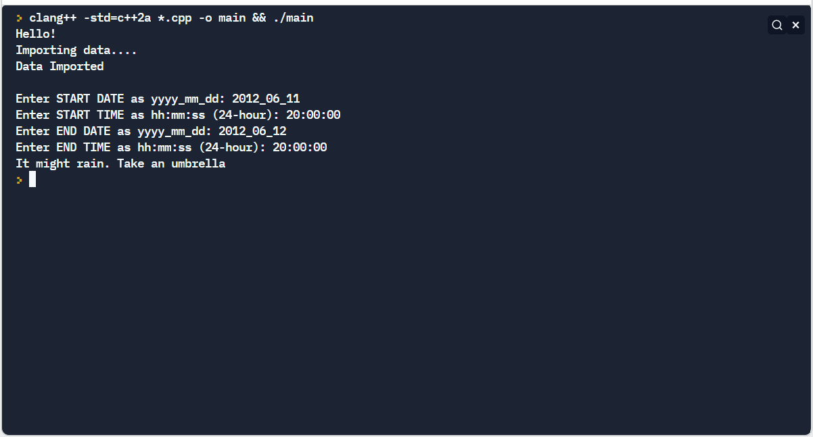

# weather-statistics-cpp
C++ project part of the LinkedIn Learning's Code Clinic series.
https://www.linkedin.com/learning/code-clinic-c-plus-plus-2/intro-weather-statistics?

## Problem: 
You are provided with a weather data set of a specific location for 4 years. The data set is divided in 4 files pertaining to each year. The files are in text format and tab separated. Some parts of the data is space separated too.

## Your task is to:
1. As user for start date-time & end date-time.
2. Calculate the pressure co-efficient for the given time range from the data provided.
3. If the co-efficient is +ve it suggests sunny weather otherwise stormy weather.
4. Tell the user if the provided date-time range has sunny or stormy conditions.

## Installation & test:
0. Clone the repo
1. Any C++ compiler Eg. clang or use an online IDE like replit
2. Build using the build command pertaining to the said compiler. 
  Eg. clang: "clang++ -std=c++17 *.cpp -o main && ./main"
3. Run main.exe

## Learning objectives:
1. Reading large data from multiple files.
2. Creating an appropriate data structure to access the data during runtime. 
3. Object Oriented programming / design concepts
4. Time manipulation
5. Decision loops
